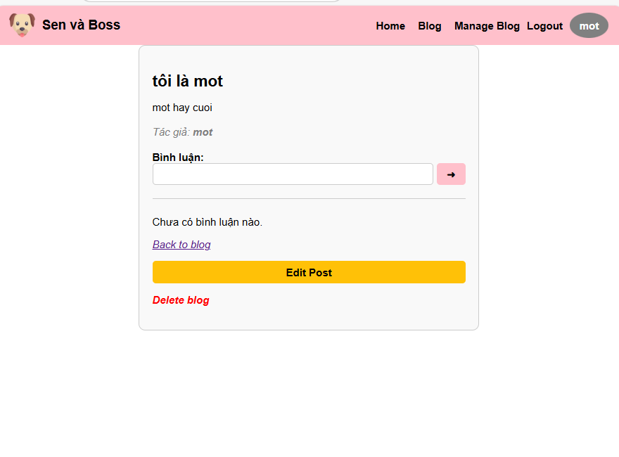
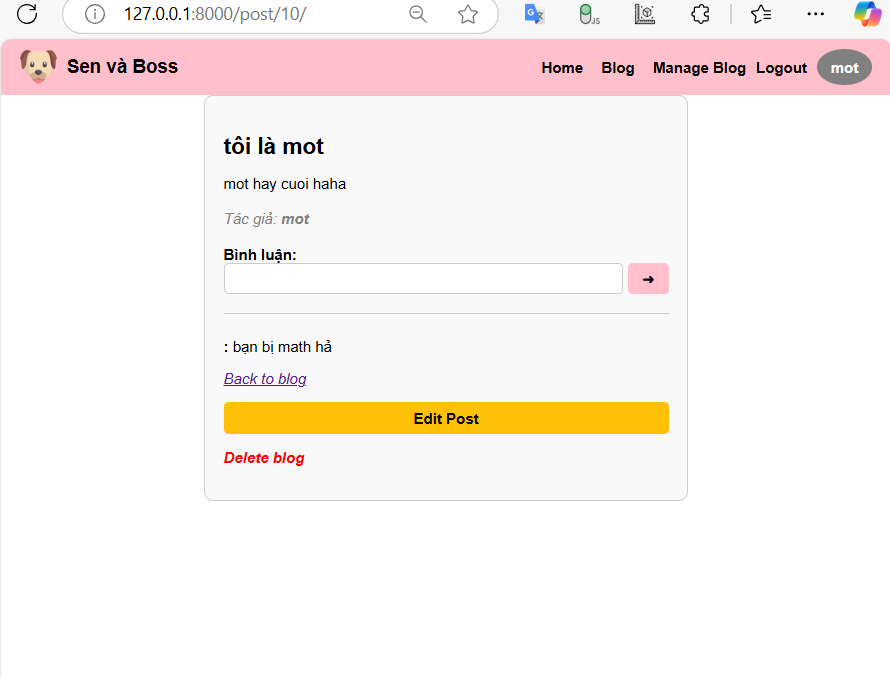
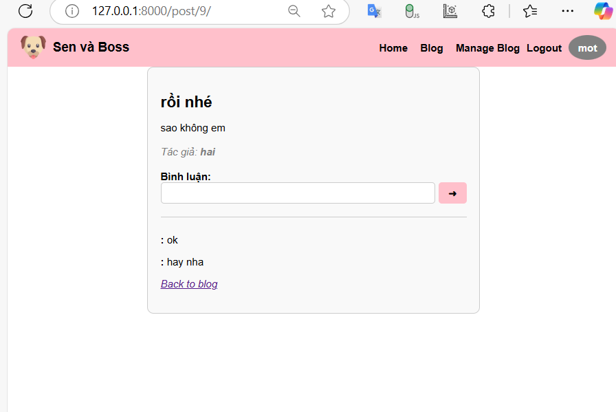

# Release Version 3 + 4 + 5
**Mô tả:** Tạo trang admin admin dùng để quán lý user. Admin có quyền khóa user (block) và reset mật khẩu cho user. Một user nếu bị block thì không thể truy cập vào tài khoản của mình. Website phải hiển thị thông báo, tài khoản của bạn đã bị khóa.

**Tiếp theo** Cho phép user có quyền quản lý bài viết (post) hoặc nhiệm vụ (task) của mình. Hãy chỉnh sữa mã để cho phép user có thể thực hiện thao tác xóa cùng lúc trên nhiều posts/
tasks cùng lúc

Tạo bài viết

Sửa bài viết của mình

Bình luận

Xóa bài viết

Với bài viết của người khác chỉ được xem và bình luận

Phân trang

Xóa tất cả các bải viết của mình cùng một lúc
